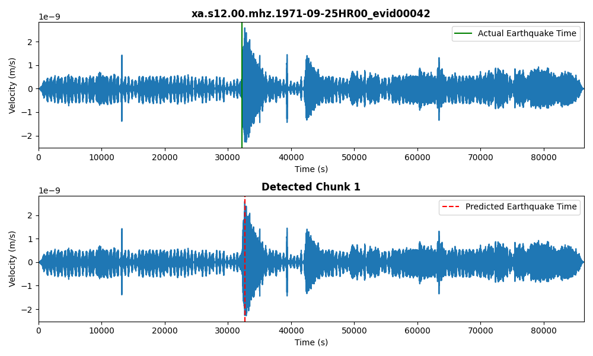
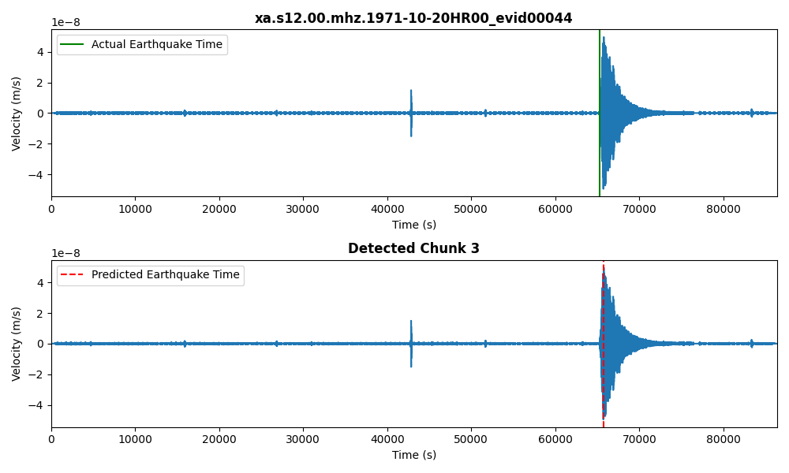

# 🌍 Halo - Earthquake Detection Using Seismology Data 🚨

Halo is a seismology project developed for Spaceapps Bahrain, aimed at detecting the precise time at which earthquakes occur. By analysing velocity data from 24-hour recordings and splitting it into manageable chunks, Halo pinpoints the earthquake occurrence by comparing variances and identifying the chunk with the smallest difference. 📊

## How It Works 🚀

The algorithm:
1. **Data Chunking:** Splits the CSV file into 5 chunks and calculates the variance of each chunk.
2. **Top 2 Chunk Selection:** Selects the top 2 chunks with the highest variance for further analysis.
3. **Fine Chunking:** Each selected chunk is split into another 5 sub-chunks.
4. **Difference Comparison:** Compares the highest point of each sub-chunk to the one on the right.
5. **Final Selection:** Chooses the chunk with the smallest difference, detecting the earthquake based on the highest point.
6. **Validation:** Compares the detected earthquake times with actual occurrences.

## Results 📈

The project generates a comparison graph between the **actual earthquake occurrence** and the **predicted time** of occurrence. Below is an example of how the results are visualized:

## Contributing 

Feel free to fork this project, create new branches, and submit pull requests! Contributions are always welcome to improve the accuracy or efficiency of Halo.

## License 

This project is licensed under the MIT License - see the LICENSE file for details.
